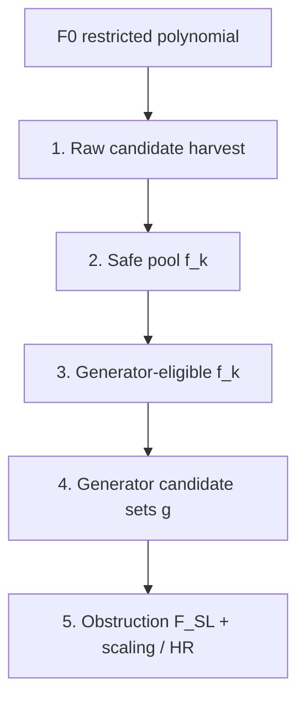

# Obstruction pipeline — precise conditions (polynomial-factor branch)

This document records **exactly** what the code checks at each stage, for the binomial and polynomial routes, and how the three main kinematic setups differ. It reflects the current `HiddenRegionFinder_polynomial_factors` branch (2026); many checks were added or tightened since the shared baseline.

**Related files:** `HiddenRegionFinder.wl`, `HRF_PolynomialCancellationFactors.wl`, `HRF_GeneratorPhysicsFilter.wl`, `HRF_KinematicGeneratorPresets.wl`, `HRF_Example03SeedStudy.wl`.

---

## Pipeline overview



Each stage **narrows** the pool. A factor can appear in an early table but fail a later gate (this is intentional — audit tables show where it dropped).

---

## Terminology: “PDF (5.12)”

In code comments and audit columns, **PDF** means **§5.12 positive-domain feasibility**, implemented as `simultaneouslyAdmissibleSubsetQ` / `positiveCompatibleQ`:

> ∃ real values of `(kin vars, x_i)` such that  
> • kinematic assumptions `KinAssump` hold (domain **K**)  
> • all Symanzik variables `x_i > 0`  
> • every factor in the subset equals **0 simultaneously**

Implementation: `FindInstance` on  
`kinAssumptions && And @@ Thread[vars > 0] && And @@ (f == 0 & /@ factors)`  
(`HiddenRegionFinder.wl`, `simultaneouslyAdmissibleSubsetQ`).

**PDF is not** the full obstruction recipe. These are **separate** later checks:

| Check | When | Symbol / function |
|--------|------|-------------------|
| PDF on factor subset | Safe pool, pair prefilter, generator trial | `simultaneouslyAdmissibleSubsetQ` |
| Per-factor PDF | Single `f_k` can vanish with `x_i > 0` | `positiveCompatibleQ` |
| Degree bounds | Factor / generator total degree, per-`x_i` exponent | `hrfGeneratorDegreeAdmissibleQ`, `hrfCancellationFactorDegreeAdmissibleQ` |
| F0 monomial support | Each generator monomial matches some `F0` term (kin sector) | `hrfGeneratorF0SupportAdmissibleQ` |
| Mandelstam linearity | Each **term** has total exponent ≤ 1 in each kin var | `hrfFactorMandelstamLinearQ` |
| Kin pair prefilter | No `f×f` with kin; no shared kin var across pair | `hrfGeneratorPairKinPrefilterQ` |
| Physics pairing | Kin×kin forbidden; kin-mixed + kin-free rules; span dedup | `hrfGeneratorPairPhysicsAdmissibleQ`, `hrfFilterFactorsForGeneratorPhysics` |
| SL ideal | `F_SL ∈ ⟨g_i⟩` exactly | `hrfObstructionSuperleadingInIdealQ` |
| SL-sector PDF | PDF on factors of generators **entering** confirmed `F_SL` | `slSectorAdmissibilityData` |
| Hidden region | Valid scaling vector for leading `U` | `hrfEvaluateValidTrialScaling`, `hrfFPObstructionRegionPresentQ` |

Audit columns name the specific gate (`JointPDFQ`, `KinPrefilterQ`, `F0SupportQ`, …). **Do not read “AdmissiblePairCount” in the selection table as “physics-admissible”** — it counts pairs passing **PDF + degree only** (see §4.3).

---

## Stage 1 — Raw candidate harvest

**Functions:** `derivativeFactors`, `derivativeFactorsExtended`, `hrfRawPolynomialCandidates`.

### 1.1 Binomial baseline (unpatched `safeCancellationFactors`)

| Source | Condition on raw piece |
|--------|-------------------------|
| `D[F0, x_i]` factorization | Drop `±1`, drop pure monomials (`monomialQ`) |
| Extended (`UseExtendedFactors -> True`) | Adds `channelDirectionFactors` on kin coefficients (wide-angle) |

No polynomial harvest; binomials only at safe-pool stage.

### 1.2 Polynomial harvest (`hrfRawPolynomialCandidates`)

| Source | Enabled when | Conditions |
|--------|--------------|------------|
| **Derivative factorization** | Always | Factors from `Factor[D[F0,x_i]]`, light-normalized |
| **Whole derivative** | `DerivativeFactorizationOnlyQ -> False` | Primitive core of full `D[F0,x_i]`: 2–`$HRFPolynomialMaxMonomials` terms, mixed sign, not monomial |
| **Signed monomial pairs** | `$HRFPolynomialEnableSignedMonomialPairs` and not deriv-only | Sums/diffs of monomial pairs from each derivative |

**Automatic “deriv-only”** (`$HRFPolynomialDerivativeFactorizationOnlyQ = Automatic`):  
`True` when **not** wide-angle two-channel `{s12,s23}` — i.e. **collinear 5pt** harvests **only** derivative factorization, not signed-pair / whole-derivative extras.

**Extended derivatives** (`DimensionfulKinVars` explicit): Regge / wide-angle channel-direction harvest via `derivativeFactorsExtended`.

---

## Stage 2 — Safe pool `f_k`

### 2.1 Binomial route

**Legacy pool** (`hrfLegacyBinomialSafeFactors`, Ex03 binomial audits):

- `derivativeFactors[F0, vars]` only  
- `binomialQ` (exactly 2 monomials in `x_i`)  
- Canonical dedup: `hrfNormalizeCancellationCandidates` (sign/shell equivalence)

**Standard `safeCancellationFactors`** (when polynomial patch off):

- Same as above + **`positiveCompatibleQ`** (single-factor PDF / domain witness)

**Extended binomial** (`safeCancellationFactorsExtended`, `UseExtendedFactors -> True`):

- Uses extended derivative harvest; still **binomial + positiveCompatibleQ**

### 2.2 Polynomial route (`hrfSafeCancellationFactorsPolynomial`)

Applies `hrfFilterPolynomialCandidates` → **`hrfCancellationFactorAcceptanceQ`** per raw candidate:

| # | Condition | Reject reason (audit) |
|---|-----------|------------------------|
| 1 | Not pure monomial after primitive strip | `pure monomial` |
| 2 | Shape: binomial **or** 2–`MaxMonomials` polynomial | `not binomial/polynomial candidate` |
| 3 | Kinematic domain (`$HRFPolynomialRequireKinematicDomainQ`) | `fails kinematic-domain compatibility` |
| 4 | Mixed signs (`$HRFRequireMixedSignCancellationFactorsQ`, default True) | `same-sign coefficients` |
| 5 | **Wide-angle only:** kin-free `f_k` if `$HRFRequireKinFreeCancellationFactorsQ` auto for `{s12,s23}` | `kin-dependent f_k (wide-angle…)` |
| 6 | Mandelstam linear in each `f_k` | `nonlinear Mandelstam monomial in f_k` |

Then **post-filters** on accepted list:

- **Canonical normalize** (`hrfCanonicalCancellationFactor`): strip shared `x_i` content, non-`x_i` shells, overall sign; dedup by equivalence  
- **Collinear deriv-only:** keep only classes present in derivative factorization harvest  
- Mandelstam-linear filter (again)  
- **`hrfCancellationFactorAdmissibleShapeQ`:** reject pure monomials and same-sign-only polynomials  

**Canonical factor display:** `hrfFormatCancellationFactorDisplay` — group by `x_i` monomial, factor kin combination (tables use this string).

### 2.3 Primitive / canonical normalization (both routes when patch loaded)

`hrfCanonicalCancellationFactor`:

1. `hrfPrimitiveCancellationFactor` — remove common `x_i` monomial from all terms  
2. `hrfStripOverallNonSymanzikFactors` — drop `Times` factors with **no** `x_i` (kin shells `(1-z)`, etc.)  
3. `hrfStripOverallSign` — fix overall sign via leading monomial coefficient  
4. `Factor[Expand[…]]`

---

## Stage 3 — Generator-eligible factors

**Function:** `hrfFilterFactorsForGenerators[safe, vars, F0, opts]`

| Step | Condition |
|------|-----------|
| Canonical dedup | `hrfCanonicalCancellationFactor` per pool member |
| Per-factor degree | `hrfCancellationFactorDegreeAdmissibleQ`: total `x`-degree and max per-`x_i` exponent ≤ bounds inferred from `F0` |

**Not applied here:** PDF on pairs, physics filter, kin prefilter (those are generator/pair stages).

**Physics-eligible subset** (PairSectors / Adaptive only, `$HRFUseGeneratorPhysicsFilterQ`):

- `hrfFilterFactorsForGeneratorPhysics`: drop kin-mixed `f_k` whose `x`-sectors lie in Q-span of kin-free factors  

---

## Stage 4 — Generator candidates

Controlled by **`GeneratorMode`** and **`HRF_KinematicGeneratorPresets.wl`**.

### 4.1 Degree / F0 bounds on generators (`hrfGeneratorDegreeAdmissibleQ`)

For generator (product) `g`:

- Total `x`-degree ≤ `MaxGeneratorTotalDegree` (default: from `F0`)  
- Massless: each monomial of `g` has each `x_i` exponent ≤ `MaxGeneratorVarExponent` (typically 1)  
- **F0 monomial support:** each monomial of `g` matches some `F0` term in kin sector (`hrfGeneratorF0SupportAdmissibleQ`)  
- **Mandelstam linear on `g`:** each term of expanded `g` linear in each kin var  

### 4.2 Kin pair prefilter (`hrfGeneratorPairKinPrefilterQ`)

Applied in SingleProduct resolver and pair audit (before listing):

- Reject `f × f` if `f` contains any kin var  
- Reject `f_a × f_b` if **same** kin var appears in both (even if polynomials differ)  

### 4.3 Pair admissibility — **two counting conventions**

| Counter | Checks | Used in |
|---------|--------|---------|
| **`AdmissiblePairCount`** (selection table) | PDF (5.12) on `{f_a,f_b}` **and** degree bounds on `f_a f_b` | `hrfFivePointGeneratorStudy`, route comparison |
| **`PairAdmissibleQ`** (pair audit) | Kin prefilter **and** PDF **and** degree **and** F0 support **and** Mandelstam linear on product | `GeneratorPairAuditTable` |

Example (Seed5pt): 5 eligible factors → selection table may show **2** PDF+degree pairs; pair audit lists **1** after kin prefilter (the chosen `z`-linear × bilinear pair).

### 4.4 Physics pairing (`hrfGeneratorPairPhysicsAdmissibleQ`) — PairSectors / Adaptive

| Rule | Detail |
|------|--------|
| Kin × kin | **Forbidden** (two factors both kin-dependent) |
| Kin-mixed + kin-free | Disjoint `x`-support; kin-free partner degree ≤ `deg(F) - deg(f_kin)` |
| Kin-free + kin-free | Disjoint `x`-support; product degree bounds |
| Kin prefilter | Shared kin var / squared kin-dependent factor |
| Module dedup | Redundant kin-mixed pair generators mod span `{B, s_a B}` |

### 4.5 Generator modes

| Mode | Construction | Typical use |
|------|--------------|-------------|
| **`SingleProduct`** | One pair `{f_a,f_b}` → `g = f_a f_b`; resolver picks lowest monomial-rank admissible pair (kin prefilter in resolver) | **Collinear 5pt** |
| **`PairSectors`** | All physics-admissible pairs → sector generators; optional multi-generator unions | **Wide-angle Crown**, boundaries |
| **`Adaptive`** | Union of SingleProduct-style subset products + PairSectors trials | Default in `findObstructions` when no preset |

**Collinear preset** (`Collinear5pt`):

```wl
GeneratorMode -> "SingleProduct"
RelaxSingleProductDegreeQ -> False
SkipPDFFindInstanceQ -> False   (* PDF enforced at resolver *)
UseExtendedFactors -> False     (* Ex03 seed study *)
```

**Per-generator admissibility** (`AdmissibleGeneratorQ` in obstruction trials):

- ≥ 2 dividing `f_k`  
- PDF on dividing factors (unless collinear legacy skip — **not** used when `RelaxSingleProductDegreeQ -> False`)  
- Degree + F0 support  

---

## Stage 5 — Obstruction search (`findObstructions`)

For each generator set `{g_i}`:

1. **Candidate admissibility** — `generatorSetAdmissibilityData`: per-generator rules + PDF on union of dividing factors  
2. **Obstruction fit** — `obstructionByOriginalTermsGeneral`:
   - **Primary:** `hrfObstructionFromGeneratorVanishing` — ideal quotient \(F = F_{SL} + \mathrm{Obs}\) via `PolynomialReduce`; derivative consistency \(\partial_i F \equiv \partial_i \mathrm{Obs} \pmod{f_k}\) on generator factor vanishing loci  
   - **Fallback:** bounded algebraic subset search (`hrfObstructionAlgebraicSearch`; meet-in-the-middle for single \(g\))  
   - **Acceptance:** exact `PolynomialReduce[F_SL, {g_i}]` remainder `=== 0`  
   - **Not used:** `FindInstance` on remainder coefficient equations  
3. **SL-sector admissibility** — `slSectorAdmissibilityData`: PDF on factors of generators **used in** `F_SL`; `F_SL ∈ ⟨g_i⟩`  
4. **Hidden region** (if `U` supplied): scaling LP / coverage on valid trials  

**`MaxObstructionTerms`:** `max(1, |F| - 1)`; generator monomial count does **not** cap obstruction size.

**Diagnostics:** `SearchMethod -> "GeneratorVanishingIdealQuotient"` when primary path succeeds; `DerivativeConsistentQ` in attempt data.

Trial ranking: prefer **more generators** (unless `PreferFewerGenerators -> True`), then smaller obstruction (`hrfObstructionTrialRank`).

Caps: `$HRFCandidateGeneratorSetLimit` (default 64), `$HRFMaxTwoGeneratorUnionTrials` (48), `$HRFObstructionAlgebraicSearchLimit` (500000, fallback only).

---

## Kinematic setups — working configuration

Presets in `HRF_KinematicGeneratorPresets.wl`. **`hrfKinematicLimitFromKinVars`** maps `{s12,s23}` → WideAngle, single `{s12|s23}` → Regge, `{s,x,z}` → Collinear.

### Wide-angle 4pt (`{s12, s23}`)

| Item | Setting |
|------|---------|
| **Kin vars** | `s12`, `s23` |
| **Safe pool** | Binomial or polynomial; **`UseExtendedFactors -> True`** for channel directions |
| **Kin-free `f_k` only** | Auto `$HRFRequireKinFreeCancellationFactorsQ` |
| **Harvest** | Derivative + whole-derivative + signed pairs (deriv-only **off**) |
| **Generator mode** | **`PairSectors`**, `MaxGenerators -> 2` |
| **Target** | Two sector generators; e.g. Crown `F_SL = s12 g1 + s23 g2` |
| **Physics filter** | On; span dedup + sector quotient |
| **Domain check** | Often `$HRFPolynomialRequireKinematicDomainQ = False` in notebooks (faster) |
| **Notebook** | `01_WideAngle_4pt.nb`, Ex04 Crown / HyperCrown |

### Regge 4pt (single channel, e.g. `{s23}`)

| Item | Setting |
|------|---------|
| **Kin vars** | One Mandelstam (channel selected) |
| **Generator mode** | **`PairSectors`**, `MaxGenerators -> 1` |
| **PreferFewerGenerators** | `True` |
| **Harvest** | Extended factors; channel-direction binomials |
| **Physics** | Kin-free sector picture; one coupled generator typical |
| **Notebook** | `02_ReggeLimit_4pt.nb`, `02a`/`02b` |

### Spacelike collinear 5pt (`{s, x, z}`)

| Item | Setting |
|------|---------|
| **Kin vars** | `s` (dimensionful), `x`, `z` (dimensionless ratios) — `CollinearDimensionfulKinVars -> {s}` |
| **KinAssump** | e.g. `s > 0`, `x < 0`, `z > 1` |
| **Safe pool** | Polynomial strict path; **deriv-only harvest**; no Regge signed-pair extras |
| **Kin-free requirement** | **Off** (kin-mixed `f_k` allowed) |
| **Generator mode** | **`SingleProduct`**: one `g = f_a f_b` |
| **Pairing** | Kin prefilter: one kin factor may pair with kin-free partner; **not** two kin factors |
| **Ex03 study flags** | `$HRFPolynomialRequireKinematicDomainQ = False`; `$HRFUsePolynomialCancellationFactors = True` |
| **Topologies** | Seed5pt (6 vars), ThreeLoopVertex (9 vars) — same rules, different `F0` |
| **Notebook** | `03_SpacelikeCollinear_5pt.nb` In[1]–In[5] seed; **In[5c]** Seed vs Vertex; Ex04 In[16]/In[19] full obstruction |

**Why one codebase needs presets:** Wide-angle needs **two kin-free sector generators** and extended harvest; collinear needs **kin-mixed `f_k`** and a **single product generator** with stricter pair kinematics. Running Crown presets on 5pt (or collinear on Crown) mis-counts pairs and harvests wrong `f_k` classes.

---

## Binomial vs polynomial route (Ex03 audit tables)

| Stage | Binomial route | Polynomial route |
|-------|----------------|------------------|
| Safe pool | `hrfLegacyBinomialSafeFactors` | `hrfSafeCancellationFactorsPolynomial` |
| Pool size (Seed5pt) | ~2 canonical binomials | ~5 canonical (deriv classes, mixed-sign) |
| Eligible | `hrfFilterFactorsForGenerators` on respective pool | same |
| Resolver | `hrfResolveSingleProductGeneratorFactors` | same |
| Selected | Often legacy binomial pair | Polynomial pair (may coincide on Seed5pt) |
| **`NonBinomialGeneratorSelectedQ`** | — | True when selected factors ∉ legacy binomial pool |

---

## Audit tables — column guide (Ex03)

| Table | Key columns |
|-------|-------------|
| **CanonicalFactorTable** | One row per canonical class; `Topology` = Seed5pt / ThreeLoopVertex |
| **GeneratorPairAuditTable** | `PairAdmissibleQ` = full gate; `RejectionReason`; Factor1 = lower `x`-degree |
| **GeneratorSelectionTable** | `AdmissiblePairCount` = **PDF + degree only**; `SelectedFactors` = resolver choice |
| **ObstructionTrialTable** | SL decomposition, sector PDF, scaling, `HiddenRegionQ` |

**In[4]–In[5]:** Seed5pt only. **In[5c]:** Seed5pt + ThreeLoopVertex (`Ex03FivePointRoutes`).

---

## Key global flags (quick reference)

| Flag | Default | Effect |
|------|---------|--------|
| `$HRFUsePolynomialCancellationFactors` | True (Ex03) | Patch routes safe pool to polynomial harvest |
| `$HRFPolynomialMaxMonomials` | Automatic | Max terms per polynomial `f_k`; Automatic sets effective cap from raw harvest max for that F0 |
| `$HRFPolynomialRequireKinematicDomainQ` | True global; **False Ex03** | FindInstance on each `f_k` at safe-pool stage |
| `$HRFPolynomialDerivativeFactorizationOnlyQ` | Automatic | True for collinear → no signed-pair harvest |
| `$HRFRequireMixedSignCancellationFactorsQ` | True | Drop same-sign polynomials |
| `$HRFUseGeneratorPhysicsFilterQ` | True | PairSectors physics + span dedup |
| `$HRFCandidateGeneratorSetLimit` | 64 | Cap generator trials |
| `$HRFUseKinematicGeneratorPresetsQ` | True | `hrfFindObstructionsForKinematicLimit[…]` |

---

## Changelog cross-reference

Implementation history and paper update map: [`ALGORITHM_CHANGELOG.md`](ALGORITHM_CHANGELOG.md).  
Regression harness: `HRF_PolynomialFactorRegressionTests.wl`, notebook `04_PolynomialFactor_Regression.nb`.
